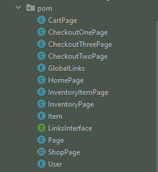
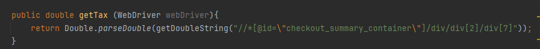
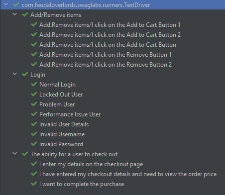

# Swag-Labs-Feudal-Overlords

## **Table Of Contents**
* [**Overview**](#overview)
* [**Project Planning (Agile - Scrum)**](#project-planning)
    - [Sprint 02/03](#sprint-02/03)
    - [Sprint 03/03](#sprint-03/03)
    - [Sprint 04/03](#sprint-04/03)
    - [User Stories](#user-stories)
* [**Tools and Dependencies**](#tools-and-dependencies)
    - [IntelliJ](#intellij)
    - [Maven](#maven)
    - [JUnit Jupiter API](#junit-jupiter-api)
    - [Cucumber Java](#cucumber-java)
    - [Cucumber JUnit](#cucumber-junit)
    - [Selenium Java](#selenium-java)
    - [Mandatory Local Tools](#mandatory-local-tools)
* [**Page Object Model Classes**](#page-object-model-classes)
* [**Behaviour-driven Development Tests**](#behaviour-driven-development-tests)
    - [Feature Files](#feature-files)
    - [Step Definitions](#step-definitions)
    - [Runners](#runners)
* [**Driver Factory Class**](#driver-factory-class)
    - [Configuration Properties](#configuration-properties)
* [**Assumptions**](#assumptions)
* [**Recommendations**](#recommendations)
* [**How to use the project**](#how-to-use-the-project)

### **Overview**

In this project, we created a testing framework for https://www.saucedemo.com/ website.

 

    <b><a href="#table-of-contents">↥ Back to top</a></b>

 

### **Project Planning**

In this project, Agile methodology implemented. Scrum methodology was used. Sprint planning, daily stand-up and retrospective meetings were hold. They helped to have well-structured plan and good communication across the team. There were 3 sprints throughout the project. Project was tracked using Trello board. 

 

    <b><a href="#table-of-contents">↥ Back to top</a></b>

 

#### **Sprint 02/03**

In first sprint, we planned the project based on testing perspective and decided to the parts that need to be tested. Page Object Model classes (POM) were created for each page. Test scenarios were written in Gherkin language according to the user stories. Factory driver class was created to make sure that all testing done in the same browser by the help of Singleton pattern. 

 

    <b><a href="#table-of-contents">↥ Back to top</a></b>

 

#### **Sprint 03/03**

In second sprint, POM classes and Gherkin statements were completed. Apart from locating web elements in POM classes, some reusable methods were also added to these classes to make the use of framework easier. Factory Driver was also updated with different browser options. We searched which options we have for cucumber options, and we created runner class to run test scenarios with particular options.

 

    <b><a href="#table-of-contents">↥ Back to top</a></b>

 

#### **Sprint 04/03**

In third sprint, Gherkin statements were implemented by creating step definitions classes. New reusable methods were also added to POM classes. Finally, slides were prepared to present our project to the rest.

 

    <b><a href="#table-of-contents">↥ Back to top</a></b>

 

#### **User Stories**

We have 3 epics in this project. These were regarding login, checkout, and inventory functionalities. These were split to different user stories. Acceptance criteria also was created for each user story, and these were used to create test scenarios which were happy and unhappy. 

 

    <b><a href="#table-of-contents">↥ Back to top</a></b>

 

### **Tools and Dependencies**

We used different tools and dependencies in this project.

 

    <b><a href="#table-of-contents">↥ Back to top</a></b>

 

#### **IntelliJ**

Intellij is an integrated development environment (IDE) written in Java for developing computer software.  

 

    <b><a href="#table-of-contents">↥ Back to top</a></b>

 

#### **Maven**

Maven is a build automation tool used primarily for Java projects. It has different lifecycles and plugins that you can configure your project.

 

    <b><a href="#table-of-contents">↥ Back to top</a></b>

 

#### **JUnit Jupiter API**

JUnit Jupiter is a dependency that can be used in unit testing for the Java programming language. We used it to test our driver factory. Also, assertions were used to assert test object.

 

    <b><a href="#table-of-contents">↥ Back to top</a></b>

 

#### **Cucumber Java**

In this project, we used Cucumber Java dependency to be able to implement our test scenarios written in Gherking langugage using Given, When, Then annotations. 

 

    <b><a href="#table-of-contents">↥ Back to top</a></b>

 

#### **Cucumber JUnit**

In this project, we used Cucumber JUnit dependency for Cucumber options. So, we can configure our testing.

 

    <b><a href="#table-of-contents">↥ Back to top</a></b>

 

#### **Selenium Java**

Selenium Java is a dependency that we can automate Web Browser by providing Web Driver. It was also used to select the Web Elements. 

 

    <b><a href="#table-of-contents">↥ Back to top</a></b>

 

#### **Mandatory Local Tools**

To be able to use this framework with 3 different browsers, we need to add 3 different exe files under resources folder which is under test folder. These are chromedriver, geckodriver for Firefox and msedgedriver.

 

    <b><a href="#table-of-contents">↥ Back to top</a></b>

 

### **Page Object Model Classes**

Page Object Model, also known as POM, is a design pattern in Selenium that creates an object repository for storing all 
web elements. It is useful in reducing code duplication and improves test case maintenance. In Page Object Model, 
you must consider each web page of an application as a class file. In this project the complete Page Object Model (POM) 
classes used are shown in the figure below:

Checkout Pages:
* These are to navigate from pages with the steps the user takes to check out. 
* They also extend from 'Page'. 
* They are also used to create methods used within the classes, for example getting the tax uses this method in 
checkout step 2:

Enum Classes:
* 'User' enum class is used to define the possible users of the site.
* 'Item' enum class is used to define the different products available to the user.
* 'GlobalLinks' enum class is used to define the links that are available on multiple pages and are exactly the same.

Links Interface Class:
* The interface that navigable Links implement enums.

Home Page Class:
* This class represents the login page.
* It extends  from Page class.

Inventory Classes:
* 'InventoryPage' represents the dropdown offered on the Inventory page to sort the products. This class extends the 
'ShopPage' super class.
* 'InventoryItemPage' represents the page that the user sees when an item is clicked on. This class also extends the 
'ShopPage' super class.

Cart Page Class:
* This class represent the page the user sees when the cart icon is clicked on.
* This class extends the 'ShopPage' super class.

Shop Page Class:
* This class is a super class which can be extended from.
* 'ShopPage' class represents adding and removing an item from the cart.

 

    <b><a href="#table-of-contents">↥ Back to top</a></b>

 

### **Behaviour-driven Development Tests**

BDD is the approach that can be used to generate tests can be understood from even non-technical people.
 

    <b><a href="#table-of-contents">↥ Back to top</a></b>

 

#### **Feature Files**

In feature files, Gherkin language was used. The keywords "Given", "When", "Then" etc. were used to generate test scenarios based on the acceptance criteria in user stories. They make tests more understandable for non-technical people. We try to use common methods as much as we can so that it makes easier to create new test scenarios effortlessly. 
 

    <b><a href="#table-of-contents">↥ Back to top</a></b>

 

#### **Step Definitions**

What we wrote in feature files were implemented in step definitions by creating objects of POM classes and using Driver Factory to provide automated browser.

 

    <b><a href="#table-of-contents">↥ Back to top</a></b>

 

#### **Runners**

In runners, we can configure our cucumber tests with cucumber options. We can also generate reports such as html, json etc.

 

    <b><a href="#table-of-contents">↥ Back to top</a></b>

 

### **Driver Factory Class**

As mentioned before, Driver Factory class was created in Singleton Pattern so that we can make sure we are working in the same browser. We have get method which is public to call from different class so that we have browser which is specified by configuration properties file. We also have in this class private constructor that prevent user from creating an object of the class. closeDriver method close the browser. All methods are static, so we can use them in class level without generating an object.

 

    <b><a href="#table-of-contents">↥ Back to top</a></b>

 

#### **Configuration Properties**

In configuration properties, we have a key called "browser" and the value can be 6 different values. These are "chrome", "chrome-headless", "firefox", "firefox-headless", "edge", "edge-headless". Configuration Reader class reads this value from the file.

 

    <b><a href="#table-of-contents">↥ Back to top</a></b>

 

### **Assumptions**

 

    <b><a href="#table-of-contents">↥ Back to top</a></b>

 

### **Recommendations**

 

    <b><a href="#table-of-contents">↥ Back to top</a></b>

 

### **How to use the project**

The TestDriver class is selected and run and completes all tests within this framework. The figure below will appear,
showing the details of each test and evidence for the test passing:

 

    <b><a href="#table-of-contents">↥ Back to top</a></b>

 
